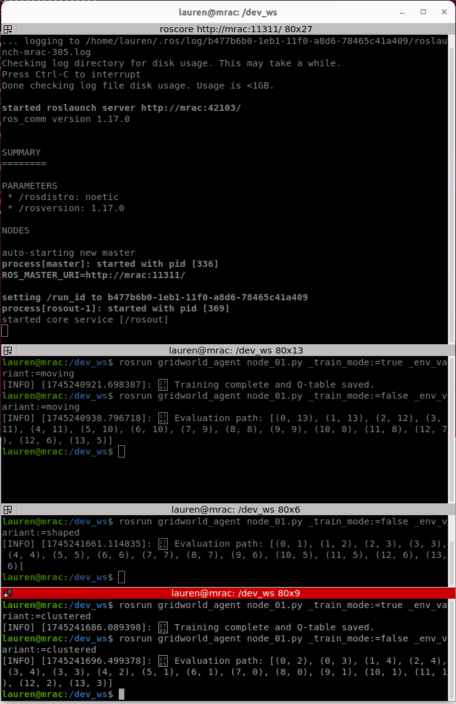

# ROS GridWorld Reinforcement Learning Project: 
## Pick and Place with Various Obstacle Behaviors

Construction environments can be chaotic, making robotic automation difficult. This project is intended to introduce reinforcement learning training and testing using to robotic movement using ROS (Robot Operating System), Gymnasium environments, and Docker to optimize robotic movement around various obstacle conditions.

## Step-by-Step Workflow

### Step 1: Setup the Workspace

Ensure your workspace structure is as follows:
```
ros_obstacles/
├── src/
│   ├── node_01.py                # Main ROS node for training/testing
│   ├── grid_world_env.py         # Grid world environment using OpenAI Gym interface
│   ├── training_utils.py         # Q-learning implementation
│   ├── reward_shaping.py         # Reward shaping logic
│   ├── obstacle_clustering.py    # Obstacle clustering logic
│   ├── moving_obstacles.py       # Moving obstacles logic
│   ├── __init__.py
├── images/                       # Contains generated evaluation GIFs
│   └── evaluation.gif
├── package.xml                   # ROS package metadata
├── CMakeLists.txt                # ROS build configuration
└── README.md
```

### Step 2: Set basis of agent - obstacle environment

(1) Fork / clone grid_world_env.py from https://github.com/michelecobelli/Reinforcement-Learning-for-Robotic-Pick-and-Place for training.

### Step 3: Create Docker Environment 

Fork / Clone from https://github.com/MRAC-IAAC/ros-introduction to set up a virtual Docker environment.

Prior to building the docker in the terminal,

    (1) rename image file from "ros-introduction" to the name of the training file, "node.01":  latest in the build_image.sh and run_user.sh files.

    (2) add all relevant libraries (rospy, gymnasium, pygame, etc.) to the Dockerfile.

### Step 4: Train your RL Agent

```bash

ros_obstacles/gridworld_agent/scripts/chmod +x node_01.py

Inside the container shell, initiate training:
```bash
rosrun gridworld_agent node_01.py _train_mode:=true _env_variant:=original
```

This will:
- Start the training mode
- Select the original environment variant
- Save the trained Q-table (`q_table.yaml`)

### Step 5: Evaluate/Test your RL Agent

After training, evaluate the trained agent:
```bash
rosrun gridworld_agent node_01.py _train_mode:=false _env_variant:=original
```

This will:
- Load the saved Q-table (`q_table.yaml`) and generate a .gif showing the trained behavior as imates/evaluation.gif.
- Evaluate the agent's performance
- Output the path taken by the agent

## Preview


### Step 6: Experiment with Environment Variants 

You can test different environment configurations:
- Clustered obstacles: `_env_variant:=clustered`
- Moving obstacles: `_env_variant:=moving`
- Reward shaping: `_env_variant:=shaped`

Example:
```bash
rosrun gridworld_agent node_01.py _train_mode:=false _env_variant:=moving
```

### Step 7: Results and Visualization 

Use provided utilities in `training_utils.py` to:
- Generate videos of agent performance
- Analyze evaluation paths and results
- View the evaluation path as a sequence of frames showing the agent's movements.


---

## Common Issues


Downloading gymnasium-1.1.1-py3-none.any.whl
    - **ERROR: Could not find a version that satisfied the requirement rospy (from versions: none).
    - **ERROR: No matching distribution found for rospy

---

## Recommended Workflow

Always perform training and evaluation inside Docker for best results:

```bash
docker run -it --rm ros_gridworld bash

# Inside Docker:
source /opt/ros/noetic/setup.bash
source /dev_ws/devel/setup.bash

# Train agent
rosrun gridworld_agent node_01.py _train_mode:=true _env_variant:=original

# Evaluate agent
rosrun gridworld_agent node_01.py _train_mode:=false _env_variant:=original
```


---

## Conclusion

This structured guide is intended to train, evaluated, and experiment with reinforcement learning agents using ROS, Gymnasium, and Docker. 
This project demonstrates the integration of reinforcement learning with a custom grid world environment inside the ROS ecosystem. By modularizing obstacle behavior and reward shaping, the system supports testing a wide range of environmental conditions. The use of Docker ensures reproducibility across systems, and the addition of GIF output makes it easier to visualize and evaluate agent behavior. This foundation can be expanded further into more complex environments, additional learning algorithms, or integration with real-world robotics simulations,

## Acknowledgements

    Creation of GitHub template: Marita Georganta - Robotic Sensing Expert
    Creation of MRAC-IAAC GitHub Structure: Huanyu Li - Robotic Researcher

## License

MIT License © LaurenD66